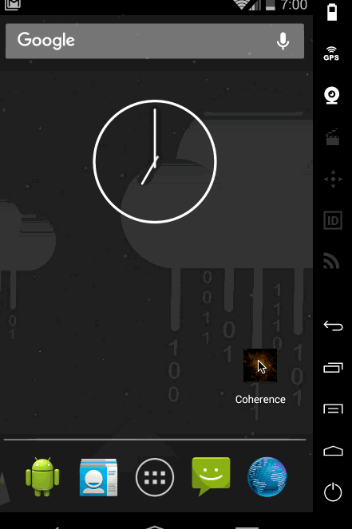

# Coherence

An app that helps you connect ideas you've had in mind as a list, e.g. shopping list, travel plan, foods/movies/books to recommend ... e.t.c. With the help of contexual idea recommendation, creating the list should be as simple as tap, tap, tap rather than type, type, type.

# Wireframe

    

# Flow

1. Selection Activity
  * Choose sub-category -> go to 2.
  * Suprise Me (Random list generator) -> go to 2
  * History - Select previously created list -> go to 2
2. List Activity
  * Toolbar Items: Save, Share, Camera (nice to have, import a list from picture of existing list)
  * Portrait (Edit mode), is simply a ListView(RecyclerView) of items:
    1. Row 1: location based suggestsion per category (e.g. Nearby restaurants, Point of Interests, ... e.t.c)
    2. Row 2: EditText that allows user put down ideas. Tapping on enter will insert a new row under this row. Swipe on existing ideas to cross it out (i.e. mark as complete or undesirable), swipe again to un-cross it. Long press to remove it.
    3. Last 10 row: Idea suggestions based on user input. Tap on suggestions will atomatically insert the idea to the list, and become the new context of suggestions. 
  * Landscape (Browsing mode), a detail view that provides detail informations on the ideas you've put down.
    * For normal lists, show detail view with fullscreen image background, show descriptions in the overlay to the right, and list all ideas on the left for quick selection.
    * For travel list, replace the idea lists with mapview.
  
# Categories

* Entertainment
  * Movie (NOTE: data source can be [themoviedb](https://www.themoviedb.org/documentation/api))
  * Drama
  * Music (NOTE: [spotify](https://developer.spotify.com/web-api/get-related-artists/) provies search api, related artists and top songs from the artist.)
  * Concerts
  * Books
* Shopping (NOTE: [Walmart API](https://developer.walmartlabs.com/docs/read/Product_Recommendation_API) takes an item and return recommended items, might be a good start.)
  * Groceries
  * Clothings
  * Electronics
  * Mobiles
* Locations (NOTE: [TripAdvisor](https://developer-tripadvisor.com/content-api/documentation/))
  * Hikes
  * Points of Interest
* Food
  * Restaurants (NOTE: [Yelp](https://www.yelp.com/developers/documentation/v2/overview))
  * Recipes

# Video Walkthrough

Here's a walkthrough of implemented user stories:

GIF created with [LiceCap](http://www.cockos.com/licecap/).
